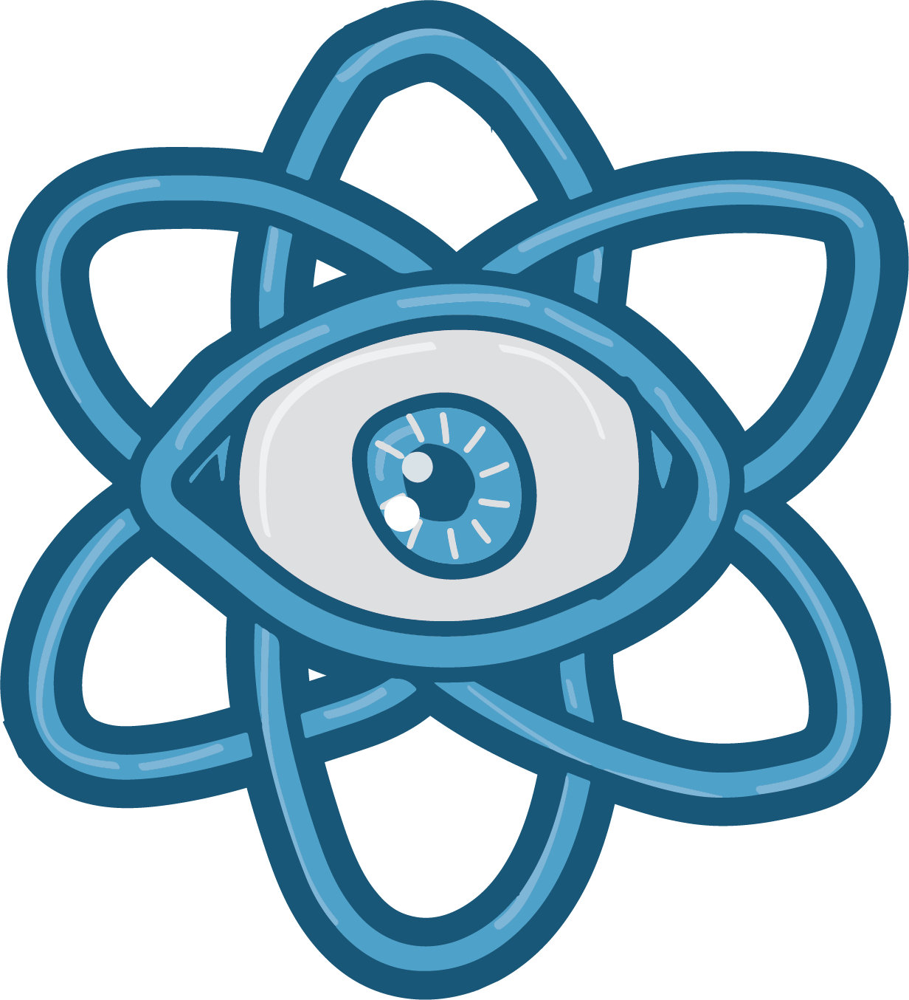

  

<h1 align="center">
  Workshop intensivo de React en 1 mes ⚡️
</h1>
<h4 align="center">
  (work in progress)
</h4>

 

  
  
  
  

<h3 align="center">
  Realizado en <a rel="noopener noreferrer" target="_blank" href="https://discord.gg/rAmPWU6eHg">Discord</a>, transmitido por <a rel="noopener noreferrer" target="_blank" href="https://twitch.tv/goncypozzo">Twitch</a>, by <a rel="noopener noreferrer" target="_blank" href="https://twitter.com/goncy">goncy</a>.
</h3>

 

## Modalidad
El workshop está pensado para ser completado en 20 días de trabajo.

* **Lunes**: Correción de proyectos.
* **Martes**, **Miércoles**, **Jueves**: Contenido.
* **Viernes**: Presentación de nuevo proyecto.

> Todos los Lunes se *debe* presentar el proyecto para ser corregido, en caso de no hacerlo, quedará fuera del workshop.

## Inscripción
La inscripción sale 1000 ARS, que serán devueltos luego de completado el workshop. En caso de no completarlo, el dinero será donado a una organización decidida por quienes completen el workshop.

## Comunicación
El workshop se llevará a cabo en un canal de [Discord](https://discord.gg/rAmPWU6eHg) y a su vez transmitido por [Twitch](https://twitch.tv/goncypozzo). Los participantes podrán hacer las preguntas necesarias durante la transmisión y contarán con un canal en discord para hacer preguntas y recibir feedback de sus proyectos.

## Contenido
Todo el contenido va a ser basado en los siguientes recursos:
* [The beginners guide to React](https://egghead.io/courses/the-beginner-s-guide-to-react)
* [Fullstack Open](https://fullstackopen.com/)
* [React2025](https://react2025.com/)

### Conocimientos requeridos:
* Conocimiento básico de JavaScript, variables, funciónes, métodos de array (filter, map, reduce), valores de retorno, argumentos, parametros, objetos, primitivos.
* Manejo básico de consola (instalar dependencias, correr comandos, moverse entre carpetas).

### Herramientas requeridas
* NodeJS > 10
* Editor de código (VSCode recomendado)

### Conocimientos deseados
* Bases de TypeScript (tipos, interfaces, enums).
* Conocimiento sobre scopes.
* Conceptos de JavaScript moderno (imports, arrow functions, destructuring, spread operator, default params).

## Cronograma
00. [Creando un proyecto](./00-herramientas)
01. [JSX](./01-jsx)
02. [Estado](./02-estado)
03. [Eventos](./03-eventos)

## Extras
0. [Recursos complementarios](./recursos-complementarios)
1. [Mentorxs](./mentorxs)
    0. [Gonzalo Pozzo](./mentorxs/gonzalo-pozzo)

## Disclaimer
Muchos de los conceptos en este workshop están sobre simplificados para hacer más fácil su comprensión. Por ende, si tu conocimiento en React es amplio, vas a notar que algunas explicaciones pueden no ser 100% acertadas.

## Licencia
MIT © [goncy](https://github.com/goncy)