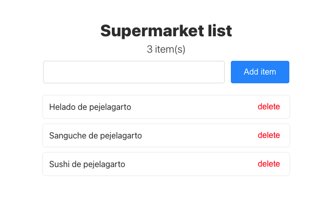

En el camino desde mi casa al supermercado, mi cerebro pierde la capacidad de retener información, por ende necesito hacer una aplicación que se encargue de esa difícil tarea. No, no puedo usar Google Keep, Evernote, nada, soy dev, la tengo que hacer, además esto es un challenge así que agarrá la pala.

### La aplicación debe:
* Mostrar un formulario para agregar elementos a la lista.
* Poder borrar cada elemento de la lista independientemente.

### Es muy importante:
* Pensar en la experiencia de usuario, minimizar la cantidad de interacciónes necesarias para usar la aplicación.
* Ser ordenada/o a la hora de codear y estructurar archivos. Keep it simple.

### Modalidad de entrega:
* Repositorio público subido a GitHub, Gitlab, Bitbucket.
* Link a la aplicación funcionando.

### Ejemplo:
> 

## Estrellas extra
* Mantener los elementos de la lista cuando vuelvo a la aplicación después de cerrarla, usando localStorage. ⭐️
* Simular un delay al cargar, guardar y borrar los elementos, como si interactuaramos con un servicio externo, usando `Promise`. ⭐️
* Usar TypeScript y tipar todos los elementos que usa la aplicación. ⭐️