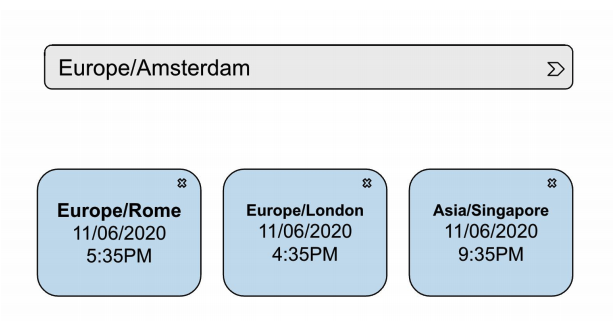

Tenemos que crear una aplicación que muestre diferentes timezones elegidos por el usuario. Esos timezones se obtienen desde [la siguiente API](http://worldtimeapi.org/) y se agregan a la aplicación desde un search box.

## Frontend
Debe tener un search box con auto complete. Debajo todos los timezones seleccionados, cada uno con su respectivo botón de borrar.

## Modalidad de entrega
* Repositorio público subido a GitHub, Gitlab, Bitbucket.
* Link a la aplicación funcionando.

## Estrellas extra
* Mantener los elementos de la lista cuando vuelvo a la aplicación después de cerrarla, usando localStorage. ⭐️
* Usar TypeScript y tipar todos los elementos que usa la aplicación. ⭐️