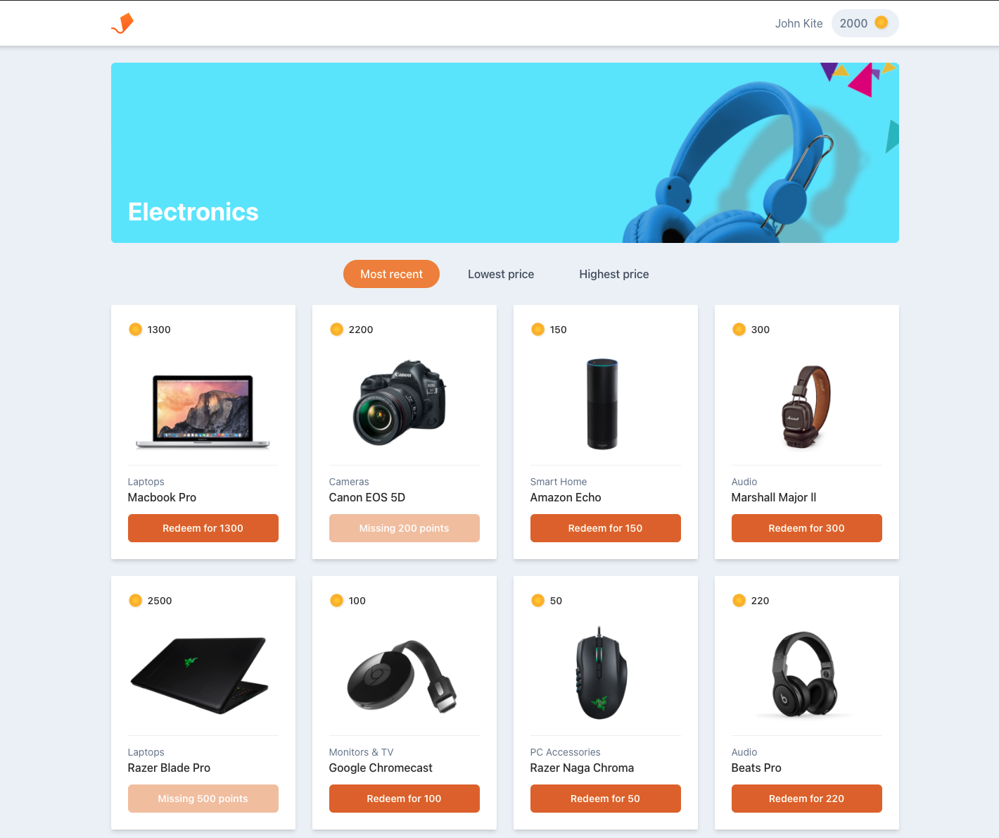

# Aerolab challenge
Se debe crear una tienda de productos basada en puntos.

### API
Podés encontrar la documentación [acá](https://aerolabchallenge.docs.apiary.io/) y podés obtener una API key [acá](https://aerolab.co/coding-challenge)

### Definición funcional
El usuario tiene una cantidad definida de puntos y cada producto vale una cantidad de puntos especifica.

* Cada producto debe tener un precio en puntos de manera visible.
* El usuario debería poder filtrar los productos por precio, de mayor a menor y vicecersa.
* El usuario debería poder ver cuantos puntos tienen en su cuenta.
* Debería haber una manera clara para el usuario de ver que productos puede comprar y cuales no.
* El botón de comprar debería estar disponible en los productos que el usuario tiene suficientes puntos para comprar.
* Cuando el usuario no puede comprar un producto, debería ver cuantos puntos le faltan para poder comprarlo.
* Un usuario no debería poder comprar un producto del cual no tiene suficientes puntos para comprar.
* Cuando el usuario compra, la cantidad de puntos debe ser deducida automaticamente de los puntos disponibles.

### Modalidad de entrega
* Repositorio público subido a GitHub, Gitlab, Bitbucket.
* Link a la aplicación funcionando.

### Estrellas extra
* Usar TypeScript y tipar todos los elementos que usa la aplicación. ⭐️
* El botón de comprar se muestra solo cuando el usuario interactua con un producto. ⭐️
* El usuario puede cargar puntos tocando sus puntos disponibles en la barra de navegación. ⭐️
* El usuario puede ver un historial de los productos que compró. ⭐️
